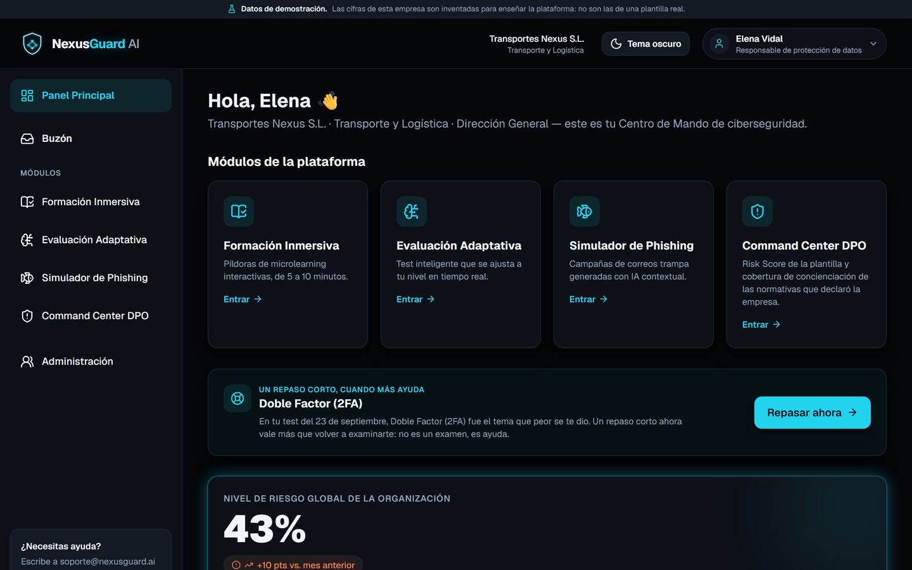
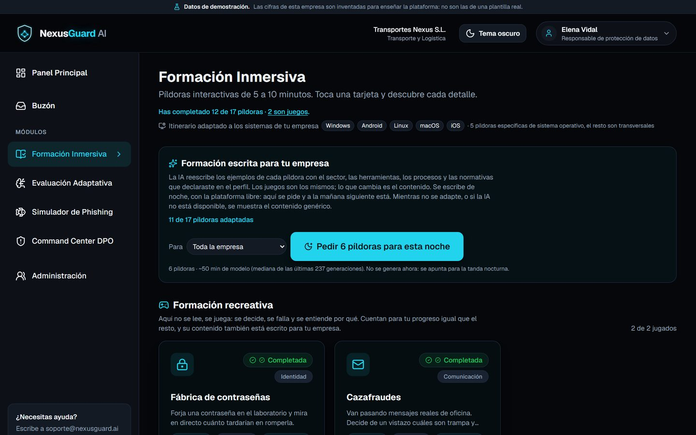

# NexusGuard AI · Beta

> **Versión beta pública (0.1.0-beta).** Este repositorio contiene una versión temprana y recortada de la plataforma. El desarrollo continúa en un repositorio privado.
>
> © 2026 Asier Augusto Schaefer. **Todos los derechos reservados**: el código se publica solo para consulta. Ver [LICENSE](LICENSE).

**NexusGuard AI** es una plataforma B2B de concienciación en ciberseguridad que adapta la formación al perfil real de cada empresa: qué sistemas operativos usa, qué herramientas, qué procesos y qué normativas le afectan (RGPD, NIS2, DORA, ENS…).

Nace como proyecto del **Máster en Ciberseguridad e Inteligencia Artificial (Evolve)**.



## Cómo funciona

1. **Perfil de la empresa.** El DPO responde un cuestionario guiado: sector, sistemas, herramientas, procesos y normativas. Ese perfil decide qué formación, qué preguntas y qué campañas tienen sentido para esa plantilla.
2. **Formación inmersiva.** Píldoras de 5 a 10 minutos con mini-juegos interactivos (fábrica de contraseñas, cazafraudes, doble factor…) en vez de diapositivas.
3. **Evaluación adaptativa.** Un test que sube o baja de dificultad según aciertas o fallas y cambia de tema cada pocas preguntas.
4. **Simulación de phishing.** Campañas de concienciación por correo, SMS (smishing) o llamada (vishing), siempre autorizadas por la empresa y con página educativa al picar.
5. **Command Center del DPO.** Risk Score de la organización, riesgo por departamento, progreso de la formación y cobertura de las normativas declaradas.



<sub>Capturas de la versión en desarrollo, con datos de demostración de una empresa ficticia.</sub>

## Qué incluye esta beta

| Módulo | En esta beta |
|---|---|
| Alta de empresa y perfil del DPO | ✅ |
| Formación con 3 píldoras interactivas | ✅ |
| Evaluación adaptativa (motor escalonado, banco reducido) | ✅ |
| Simulador de phishing (señuelos por plantilla, EMAIL/SMS/LLAMADA) | ✅ |
| Command Center: Risk Score, gráficas y cobertura normativa | ✅ |
| Motor adaptativo con modelo entrenado | 🔒 Versión completa |
| Adaptación del contenido al perfil de cada empresa con IA local | 🔒 Versión completa |
| Señuelos de phishing personalizados con IA | 🔒 Versión completa |
| Informe de cumplimiento redactado automáticamente | 🔒 Versión completa |
| Exportación a Obsidian / Excel y grafo de la empresa en Neo4j | 🔒 Versión completa |
| Autenticación, multiempresa y administración | 🔒 Versión completa |

## Stack

- **Web:** Next.js (App Router) · React · TypeScript · Tailwind CSS · Prisma · PostgreSQL
- **Servicio de IA:** FastAPI (Python) · Ollama (modelos locales: los datos de la empresa no salen de su infraestructura)
- **Infraestructura local:** Docker Compose

## Arranque en local

Requisitos: Node.js 22+, Python 3.12+, Docker.

```bash
# Base de datos
docker compose up -d postgres

# Web
npm install
cp apps/web/.env.example apps/web/.env
npm run prisma:deploy
npm run prisma:seed
npm run dev:web                 # http://localhost:3000

# Servicio de IA (otra terminal)
cd apps/api
python -m venv .venv && . .venv/bin/activate   # Windows: .venv\Scripts\activate
pip install -r requirements-dev.txt
uvicorn app.main:app --port 8010               # http://localhost:8010/docs
pytest
```

En Windows, `npm run dev` lo levanta todo con `scripts/dev.ps1`.

## Ética

Las campañas de phishing de NexusGuard son **simulaciones de concienciación** que la propia empresa autoriza, con dominios y teléfonos ficticios, y cuyo único fin es formar a la plantilla. La plataforma no está pensada para ningún otro uso, y la licencia lo prohíbe.

## Licencia

**Todos los derechos reservados.** Este repositorio es público para que se pueda consultar. **No** es software libre: no se permite copiarlo, modificarlo, redistribuirlo, usarlo comercialmente ni usarlo para entrenar modelos de IA sin permiso escrito. Detalles en [LICENSE](LICENSE).

Si te interesa el proyecto o quieres colaborar, abre una *issue*.
